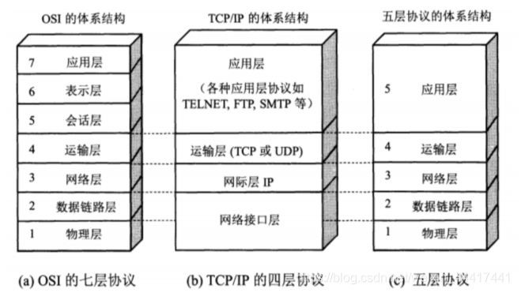

# 网络基础知识

计算机网络，根据其规模可分为WAN(Wide Area Network, 广域网)和LAN(Local Area Network, 局域网)

## 计算机与网络发展的七个阶段
1. 批处理
2. 分时系统
3. 计算机之间的通信
4. 计算机网络的产生
5. 互联网的普及
6. 以互联网技术为中心的时代
7. 从“单纯建立连接”到“安全建立连接”

## 协议
协议就是计算机与计算机之间通过网络实现通信时事先达成的一种“约定”。这种“约定”使那些由不同厂商的设备、不同的CPU以及不同的操作系统组成的计算机之间，只要遵循相同的协议就能实现通信。

协议可以分为很多种，每一种协议都明确界定了它的行为规范。

两台计算机之间必须能够支持相同的协议，并遵循相同协议进行处理，才能实现相互通信。

## 常见的三种网络参考模型
