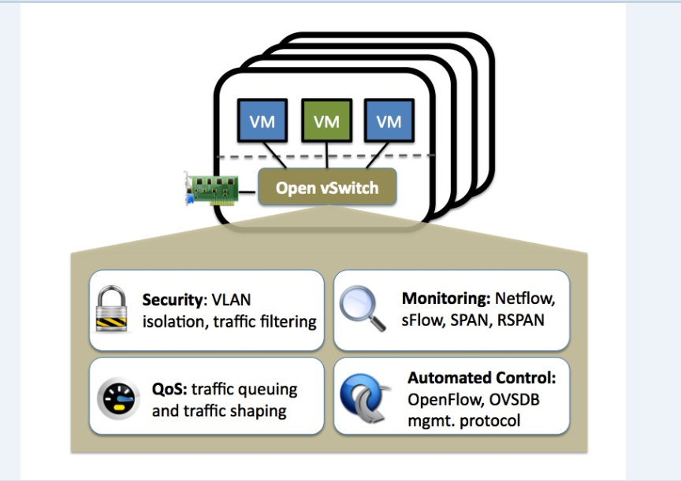

## 2.1 什么是Open vSwitch（What Is Open vSwitch）

### 2.1.1 概述（overview）

Open vSwitch 是根据开源 Apache 2 许可证授权的多层软件交换机。我们的目标是实现一个生产质量交换平台（a production quality switch platform），支持标准管理接口，并开放转发功能以进行编程扩展和控制。

Open vSwitch 非常适合在 VM 环境中充当虚拟交换机。除了向虚拟网络层公开标准控制和可见性接口之外，它还旨在支持跨多个物理服务器的分发。Open vSwitch 支持多种基于 Linux 的虚拟化技术，包括 KVM 和 VirtualBox。

大部分代码是用独立于平台的 C 语言编写的，并且可以轻松移植到其他环境。当前版本的 Open vSwitch 支持以下功能：

- 具有中继和接入端口的标准 802.1Q VLAN 模型
- 上游交换机上使用或不使用 LACP 的 NIC 绑定
- NetFlow、sFlow(R) 和镜像可提高可见性
- QoS（服务质量）配置以及监管
- Geneve、GRE、VXLAN、STT、ERSPAN、GTP-U、SRv6、Bareudp 和 LISP 隧道
- 802.1ag 连接故障管理
- OpenFlow 1.0 以及众多扩展
- 具有 C 和 Python 绑定的事务配置数据库
- 使用Linux内核模块的高性能转发

Open vSwitch 还可以完全在用户空间中运行，无需内核模块的帮助。这种用户空间实现应该比基于内核的交换机更容易移植。用户空间中的OVS可以访问Linux或DPDK设备。**注意（Note）**具有用户空间数据路径和非 DPDK 设备的 Open vSwitch 被视为实验性的，并且会带来性能成本。

### 2.1.2 这里有什么（what‘s here）

该发行版的主要组成部分是：

- ovs-vswitchd，一个实现交换的守护进程，以及用于基于流的交换的配套Linux 内核模块。
- ovsdb-server，ovs-vswitchd 查询以获取其配置的轻量级数据库服务器。
- ovs-dpctl，用于配置交换机内核模块的工具。
- 用于为Red Hat Enterprise Linux 构建RPM 和为Ubuntu/Debian 构建deb 软件包的脚本和规范。
- ovs-vsctl，用于查询和更新ovs-vswitchd 配置的实用程序。
- ovs-appctl，一个向正在运行的Open vSwitch 守护程序发送命令的实用程序。

Open vSwitch还提供了一些工具：

- ovs-ofctl，用于查询和控制OpenFlow 交换机和控制器的实用程序。
- ovs-pki，用于创建和管理OpenFlow 交换机的公钥基础设施的实用程序。
- ovs-testcontroller，一个简单的OpenFlow 控制器，可能对测试有用（但不适用于生产）。
- tcpdump 的补丁，使其能够解析OpenFlow 消息。

## 2.2 为什么需要Open vSwitch（Why Open vSwitch）

虚拟机管理程序需要能够桥接虚拟机之间以及与外部世界之间的流量。在基于 Linux 的虚拟机管理程序上，这过去意味着使用快速且可靠的内置 L2 交换机（Linux 桥）。因此，有理由问为什么要使用 Open vSwitch。

答案是，Open vSwitch 的目标是多服务器虚拟化部署，而之前的堆栈不太适合这种环境。这些环境的特点通常是高度动态的端点、逻辑抽象的维护以及（有时）与专用交换硬件的集成或卸载。

以下特性和设计考虑因素有助于 Open vSwitch 应对上述要求。

### 2.2.1 状态的流动性（The mobility of state）

与网络实体（例如虚拟机）关联的所有网络状态应该易于识别并且可以在不同主机之间迁移。这可能包括传统的“软状态”（例如 L2 学习表中的条目）、L3 转发状态、策略路由状态、ACL、QoS 策略、监控配置（例如 NetFlow、IPFIX、sFlow）等。

Open vSwitch 支持在实例之间配置和迁移慢速（配置）和快速网络状态。例如，如果虚拟机在终端主机之间迁移，则不仅可以迁移相关配置（SPAN 规则、ACL、QoS），还可以迁移任何实时网络状态（包括例如可能难以重建的现有状态）。此外，Open vSwitch 状态由真实数据模型键入和支持，允许开发结构化自动化系统。

### 2.2.2 动态地响应网络（Responding to netwrok dynamics）

虚拟环境通常具有高变化率的特点。虚拟机的进出、虚拟机在时间上的前后移动、逻辑网络环境的变化等等。

Open vSwitch 支持许多功能，使网络控制系统能够响应并适应环境的变化。这包括简单的计数（accounting）和可视化支持（visibility support），例如 NetFlow、IPFIX 和 sFlow。但也许更有用的是，Open vSwitch 可使用支持远程触发器的网络状态数据库 (OVSDB)。因此，编排软件（orchestration software）可以“观察”网络的各个方面，并在它们发生变化时做出响应。如今，它被大量使用，例如响应和跟踪虚拟机迁移。

Open vSwitch 还支持 OpenFlow 作为导出远程访问以控制流量的方法。其用途有很多，包括通过检查发现或链路状态流量（例如 LLDP、CDP、OSPF 等）进行全局网络发现。

### 2.2.3 逻辑标签的维护（Maintenance of logical tags）

### 2.2.4 硬件集成（Hardware integration）

### 2.2.5 总结（Summary）