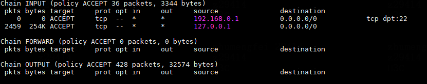

# iptables常用命令集合
```bash
# 查看iptables规则
iptables -nvL

# 创建自定义链
iptables -t filter -N test_chain

# 添加规则
iptables -t filter -A test_chain -s 127.0.0.1 -p tcp -j ACCEPT

# 插入规则
iptables -t filter -I test_chain -s 127.0.0.1 -p udp -j ACCEPT
iptables -t filter -I test_chain 5 -s 127.0.0.1 -p udp -j ACCEPT

# 删除规则
iptables -t filter -nvL test_chain --line-numbers # 列出指定链中的所有规则，并显示规则的序号。
iptables -t filter -D test_chain rule_numbers # 根据规则的序号进行删除
iptables -t filter -D test_chain -s 127.0.0.1 -s tcp -j ACCEPT # 通过规则的具体内容进行删除，如果有重复的相同规则，一次仅删除一条。
# 若无对应规则，则返回无匹配规则的提示

# target使用自定义链
iptables -t filter -N test_target # 创建一个自定义链
iptables -t filter -I test_chain -j test_target

# 清空指定链
iptables -F test_chain

# 清空所有链
iptables -F 

# 修改默认链的默认策略
iptables -t filter -P INPUT DROP
iptables -t filter -P FORWARD REJECT

# 删除自定链（链中不能有规则，链不可以被其他链使用）
iptables -X test_chain

```

## iptables -nvL 各栏含义


| 字段  | 含义  |
| :---: | :---: |
| pkts |  匹配的数据包个数  |
| bytes | 匹配的数据包大小  |
| target  | 目标（动作）  |
| prot  | 协议  |
| opt | 数据包的选项，基本都为默认的“--”  |
| in  | 数据包进入的网络接口  |
| out | 数据包离开的网络接口  |
| source  | 源地址  |
| destination | 目的地址  |
|     | 其他模块和扩展配置，例如指定端口等 |


# iptables 命令的基本构成
iptables [-t TABLE] [COMMAND] [OPTION]

TABLE 默认为filter，可选{raw nat mangle filter}

## COMMAND
- -A, --append chain rule-specification
  
  将一个或多个规则附加在所选链的末尾。当源地址和/或目的地址解析为多个地址时，将为每个可能的地址组合添加一条规则。

- -D, --delete chain rule-specfication
  
  -D, --delete chain rulenum
  
  从所选链中删除一条或多条规则。该命令有两个版本：可以将规则指定为链中的顺序序号（第一个规则从1开始）或要匹配的具体规则。

- -I, --insert chain [rulenum] rule-specification
  
  在选定的链中插入一个或多个规则作为给定的规则编号。因此，如果规则编号为1，则将一条或多条规则插入到链的头部。如果未指定规则编号，则使用默认值1。

- -R, --replace chain rulenum rule-specification
  
  替换所选链中的规则。如果源地址和/或目标地址解析为多个地址，该命令将失败。规则编号从1开始。

- -L, --list [chain]
  
  列出所选链中的所有规则。如果未选择链，则列出所有链。
  
  该命令默认在filter表中进行处理，如果想查看其他table的内容，需要使用-t [table] 参数。

- -F, --flush [chain]
  
  刷新选定的链（如果没有指定，则将刷新表中所有的链）。该操作等同于清空链，会将所有的规则一一删除。

- -Z, --zero [chain]
  
  将所有链中的数据包和字节计数器清空。指定 -L、--list 选项也是合法，与 -L 结合可以在计数器被清除前查看它们。

- -N, --new-chain chain
  
  根据给定名称创建新的用户自定义链。新链的名字必须唯一，不可与已有链相同。

- -X, --delete-chain [chain]
  
  删除指定的用户自定义链。
    - 删除条件：
    - 1. 当前链不可被引用，若被引用，则必须先删除或替换引用规则。
    - 2. 当前链必须为空，即不包含任何规则。

    如果未指定链[chain]，该命令将尝试删除表中所有的非内置链（用户自定义链）

- -P, --policy chain target
  将链的默认策略修改为指定target。关于[target](#target)的具体信息请点击。
  
  注意：只有内置链具有默认策略，且内置链与用户自定义链均不可作为target。

- -E, --rename-chain old-chain new-chain
  
  将用户指定的链重命名为用户提供的名称。该操作仅为装饰性的，对表的结构没有影响。

- -h
  帮助文档


## TARGET
  防火墙规则指定数据包的标准和目标。如果数据包不匹配，则检查链中的下一条规则；如果匹配，则下一个规则由TARGET（目标值）指定，TARGET可以是用户自定义链的名称，也可以是特殊值（ACCEPT、DROP、QUEUE、RETURN等）之一。

