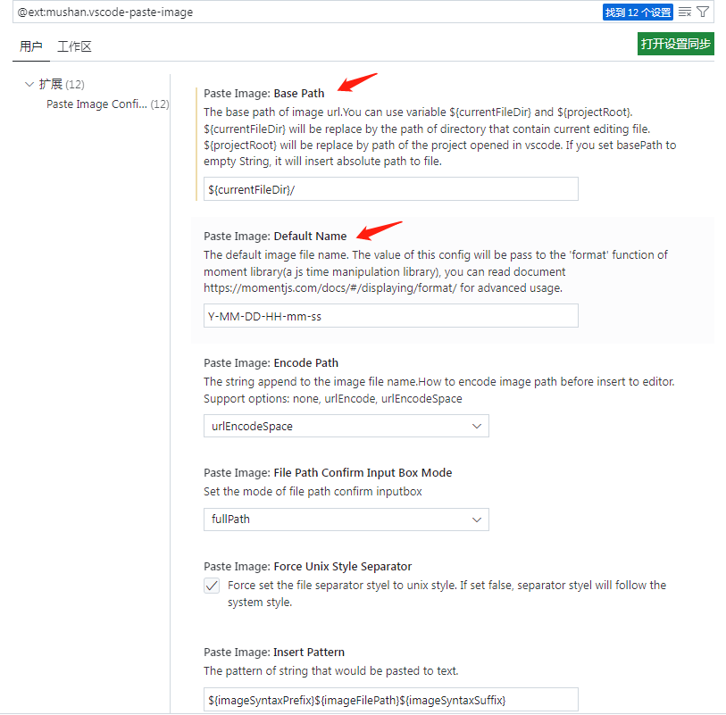
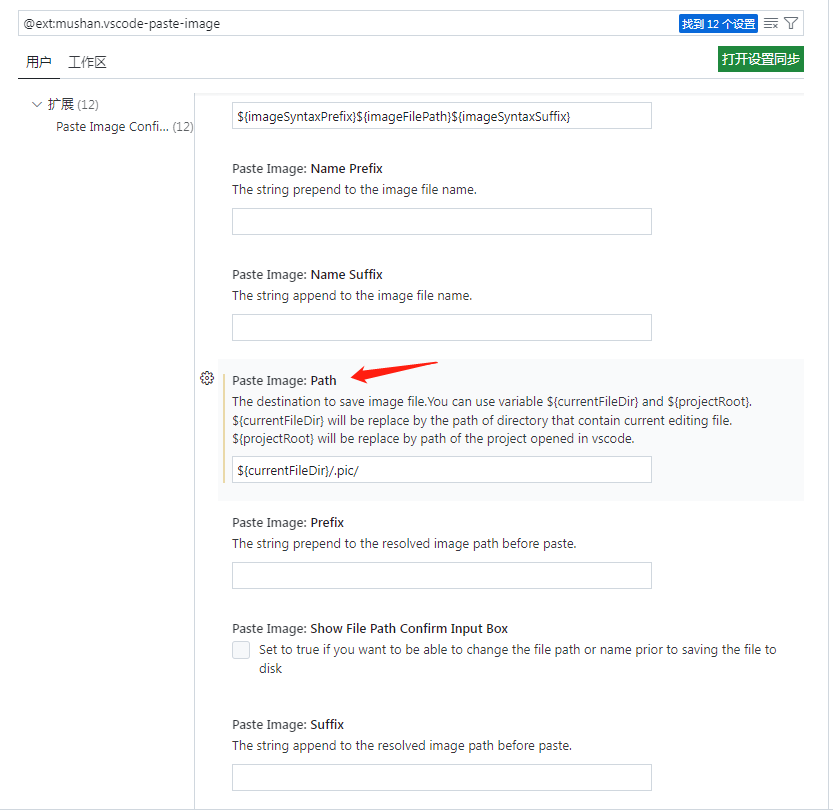

# Markdown 编辑工具

## 1. Markdown Preview Github Styling
使用crtl+shift+v打开预览界面，可实时查看自己的编辑效果

## 2. Markdown All in One
提供快捷键进行快速编写，具体内容待体验

## 3. Paste Image
可以直接在编辑界面添加图片，图片的路径可自定义。

使用crtl+atl+v可将复制的图片进行快速粘贴。

扩展设置中可定义基础路径、默认的图片名字、图片保存的路径。其他还有很多配置项，待之后慢慢体验。

